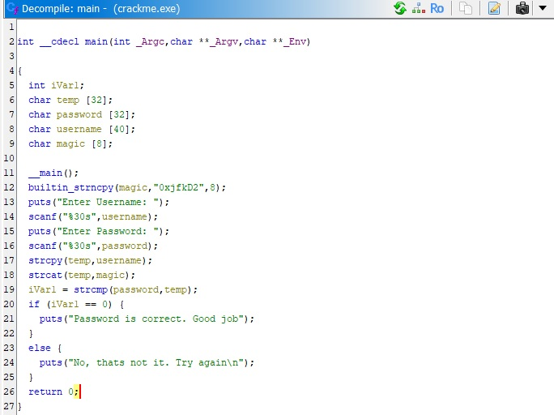
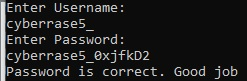

# Very Easy Crackme
[crackmes.one link](https://crackmes.one/crackme/66b8fcbf90c4c2830c821efc)

## Challenge Objective
Input correct username and password.

## Overview
|   |   |
|---|---|
| Platform | Windows |
| Architecture | x86-64 |
| Difficulty | 1.4/6 |

## Tools Used
- Ghidra

## Process
Running the program gives a username and password prompts.

Decompiling the code with Ghidra returns a short C-like program. I've renamed the variables from `local_X` to something more readable. 

### Analysis
A magic string _0xjfkD2_ is copied into variable `magic`. Username is copied into variable `temp`, and `magic` is appended to `temp`. Then `temp` is compared with `password`, and them being equal ends the program with the right output.

## Outcome
Appending the magic string to the username gives the correct password.

## Lessons Learned
Nothing really, this was quite easy. I did learn how to rename variables in Ghidra.

## References
None
